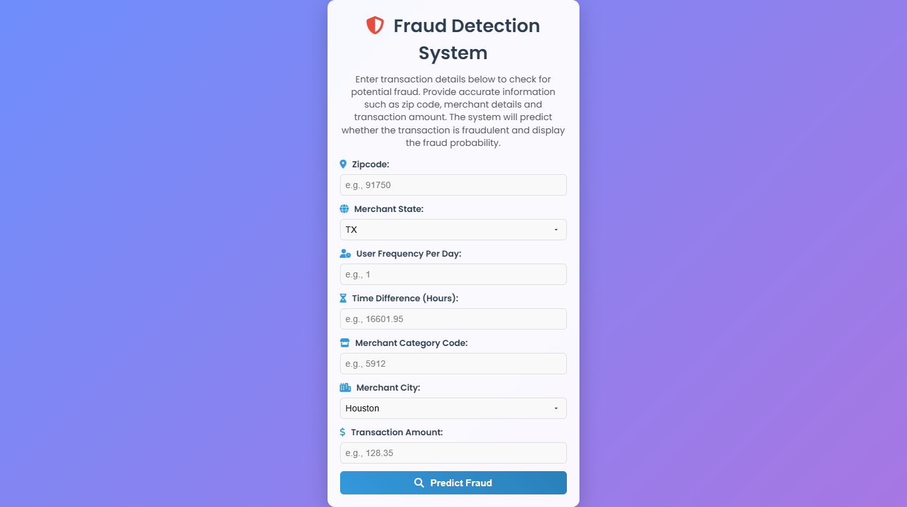

# Fraud Detection System



A modern, web-based fraud detection system built with Flask and PyTorch Geometric, utilizing a Graph Neural Network (GNN) to predict fraudulent transactions. The system features a compact, user-friendly interface with a vibrant design, allowing users to input transaction details and receive real-time fraud predictions with probability scores.

## Table of Contents
- [Overview](#overview)
- [Features](#features)
- [Project Structure](#project-structure)
- [Installation](#installation)
- [Usage](#usage)
- [Screenshots](#screenshots)
- [Technologies](#technologies)
- [Contributing](#contributing)
- [License](#license)

## Overview

The Fraud Detection System enables users to input transaction details (e.g., zip code, merchant state, transaction amount) and predicts whether a transaction is fraudulent using a pre-trained Graph Attention Network (GAT). The app features a sleek, modern UI with a gradient background, Font Awesome icons, and a compact form for easy interaction. A clear description guides users on how to use the system, and the output includes both a fraud/non-fraud prediction and a probability score.

## Features

- **Real-Time Fraud Prediction**: Uses a GNN model to analyze transaction data and predict fraud.
- **Compact & Modern UI**: A streamlined form with a gradient background, icons, and hover animations.
- **User-Friendly Description**: Guides users on input requirements and result interpretation.
- **Responsive Design**: Optimized for both desktop and mobile devices.
- **Robust Error Handling**: Validates inputs and provides clear error messages.
- **Scalable Architecture**: Built with Flask and PyTorch for easy extension.

## Project Structure

```
fraud-detection-system/
├── .gitignore                # Git ignore file for venv, model files, etc.
├── app.py                    # Main Flask application with GNN prediction logic
├── fraud_gnn_model.pth       # Pre-trained GNN model (not tracked in Git)
├── optimal_threshold.txt     # Optimal threshold for fraud prediction (not tracked)
├── templates/
│   └── index.html            # HTML template for the web interface
├── static/
│   └── style.css             # CSS for the modern, compact UI
├── js/
│   └── script.js             # JavaScript for client-side form validation
├── images/
│   └── image.png             # Screenshot or logo for the README

```


## Installation

1. **Clone the Repository**:
   ```
   git clone https://github.com/your-username/fraud-detection-system.git
   cd fraud-detection-system
   ```

2. **Set Up a Virtual Environment:**
```
python -m venv venv
source venv/bin/activate  # On Windows: 
```
3. **Install Dependencies:**
```

pip install flask pandas numpy torch torch-geometric

```
- Prepare Model Files:
    - Ensure fraud_gnn_model.pth and optimal_threshold.txt are in the project root.
    - If you don’t have these files, train the GNN model or use a dummy optimal_threshold.txt with a value like 0.5 for testing.

4. **Run the Application:**
```
python app.py
```

### UsageAccess 
- Access the Web Interface:
    - Navigate to http://127.0.0.1:5000 after running the app.

- Enter Transaction Details:Fill out the form with transaction data:
    - Zipcode: e.g., 91750
    - Merchant State: Select from the dropdown (e.g., TX)
    - User Frequency Per Day: e.g., 1
    - Time Difference (Hours): e.g., 16601.95
    - Merchant Category Code: e.g., 5912
    - Merchant City: Select from the dropdown (e.g., Houston)
    - Transaction Amount: e.g., 128.35

### Submit the Form:
- Click the "Predict Fraud" button to get a prediction.
- The result will display as “Transaction: Fraud” or “Transaction: Not Fraud” with a fraud probability score.

### Handle Errors:
- If an error occurs (e.g., invalid input, missing model files), a clear message will appear in the UI.

### Technologies
- Flask: Web framework for the backend.
- PyTorch & PyTorch Geometric: For the GNN-based fraud prediction model.
- Pandas & NumPy: For data processing.
- HTML/CSS/JavaScript: For the frontend interface and validation.
- Font Awesome: For icons in the UI.
- Google Fonts (Poppins): For a modern typography style.

